# My Vehicle History

The purpose of this website is to provide users with somewhere to keep a log of their vehicles. Whether currently and/or previously owned.
With this application I hope to provide a solution to the real world case, I have experienced myself over the years. With regards to people I have met or know, who are enthusiastic about their own vehicles.
Typically during a discussion about vehicles we have owned, I find it would be nice to actually see a photograph of the vehicle in question. Only to remember it's tucked away in a drawer or on an old phone or a hard-drive, somewhere!
With the above in mind, I have decided to call this website, My Vehicle History.

You can view the site on Am I Responsive [here](https://ui.dev/amiresponsive?url=https://my-vehicle-history-451330bb3a9a.herokuapp.com/)

The live link can be found [here](https://my-vehicle-history-451330bb3a9a.herokuapp.com/)

## User Experience (UX)

My intended and expected audience will consist of friends and people I know, that have a passion for their vehicles. Also, generally anyone that would like to use the sites services to keep a log of their vehicles, or just for the pleasure of viewing a selection of other member's cars, motorcycles, etc.
My intention has been to design a website that is visually pleasing, easy to use, and one which I hope my audience will enjoy using. And will return to again in time, to add more content to their vehicle history.

## User Stories

### New Site Users

- As a new site user, I would like to view a selection of vehicles consisting of those presented by the existing member's of the website.

- As a new site user, I would like to be able to preform a search through the vehicles on the Show Vehicles page by either, make, model or vehicle type.

- As a new site user, I would like to be able to have a way to easily navigate my way around the site.

- As a new site user, I would like to register as a new site member, and have access to my own profile area. With the ability to be able to upload details of my vehicle, including an image of my vehicle.

- As a new site user, I would like to be able to edit the details and image of my vehicle, and to save those changes.

- As a new site user, I would like the ability to add my own vehicle to the Show Vehicles page, alongside other site member's vehicles.

- As a new site user, I would like the ability to not add my own vehicle to the Show Vehicles page, alongside other site member's vehicles. I would prefer if it were kept private to myself.

- As a new site user, I would like to be able to delete any of my vehicles from my collection if I choose.

- As a new site user, I would like the ability to sign out of the website.

### Returning Site Users

- As a returning site user, I would like to able to sign back in to the site so that I can see my own profile.

- As a returning site user, I would like all of the abilities of a new user, so that I can create, edit and delete vehicles from my vehicle history.

### Site Administrator

- As a site administrator, I should be able to sign-in to the website and have more priviledges than a general user.

- As a site administrator, I should be able to edit the names used for the vehicle types selection options.

- As a site administrator, I should be able to create new vehicle types to be used within the vehicle types selection options.

- As a site administrator, I should be able to delete any vehicle type.

## Design

### Colour Scheme

I have chosen a colour scheme that I hope gives the site a clean look, and one that is visually appealing to the user.
I have chosen British Racing Green as the main site colour used for the logo, the navbar and favicon. I hope it portraits a sense of history.
I opted to use an off white colour called, Seasalt for the background. In order to help emphasis the white colour of the card components on display. Seasalt is also used for any white based text within the site.
For the main text colour, I choose Oxford Blue in order to maintain a very good contrast to the background colours in use.
As for the buttons used throughout the site. I decided to use a discordant colour combination. Hopefully making it more intuitive for the user as to what kind of action each may perform. Penn Red and True Blue.

- `# 004225` - British Racing Green - Logo, favicon and navigation.
- `# 0A122A` - Oxford Blue - General text, headings, labels.
- `# FBFAF8` - Seasalt - Background colour, text used in logo and favicon.
- `# 3066BE` - True Blue - Button.
- `# A00005` - Penn Red - Button.

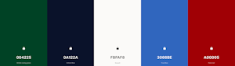

### Typography

I wanted to use two differing but complimenting typfaces. One to be used for the site logo, the other for general use. I wanted to use typefaces that look modern against the 'historical' green in the colour scheme.
I opted for Montserrat italic for the logo.

- 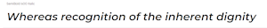
- [Montserrat](https://fonts.google.com/specimen/Montserrat?query=montserrat)

 Dosis for all other text.

- 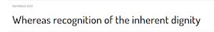
- [Dosis](https://fonts.google.com/specimen/Dosis?query=dosis)

- [Font Awesome](https://fontawesome.com) icons were used throughout the site, such as the icons used on the Add Vehicle Page.

### Imagery

All images used throughout this site have been supplied by myself, of my own vehicle. Or by people I know that have registered to use the site.

## Wireframes

To follow best practice, wireframes were developed for mobile, tablet, and desktop sizes.
I've used [Balsamiq](https://balsamiq.com/wireframes) to design my site wireframes.

### Registration Page Wireframes

- 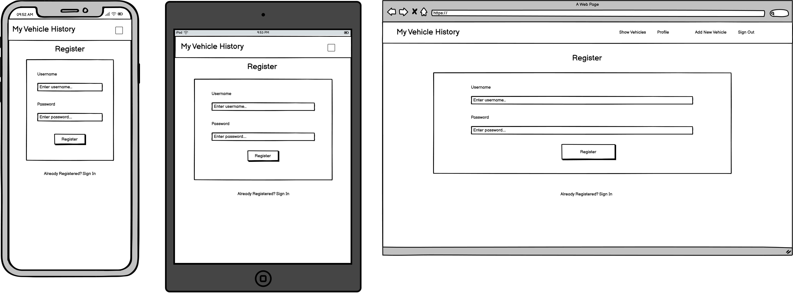

### Sign-In Page Wireframes

- 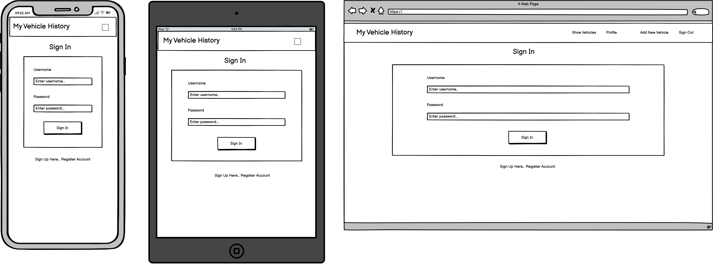

### Show Vehicles Page Wireframes

- 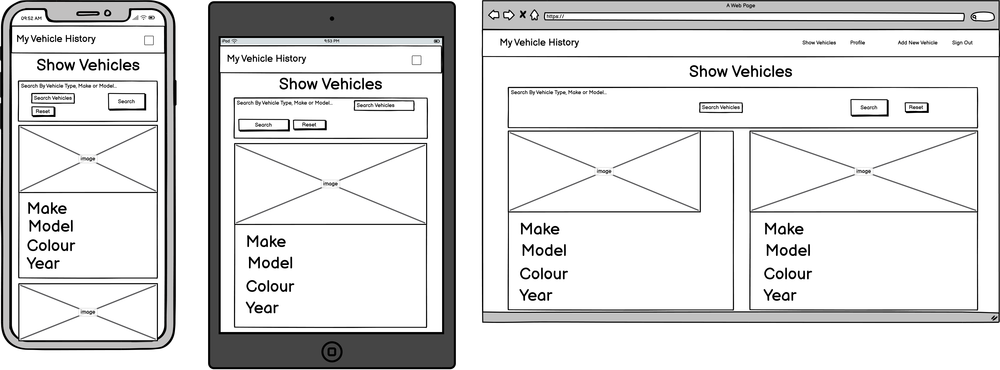

### Profile Page Wireframes

- 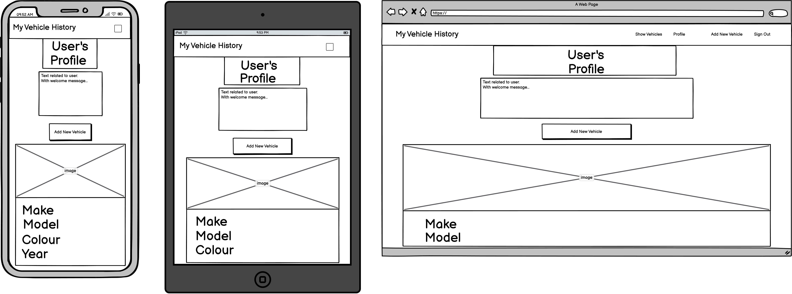

### Add New Vehicle Page Wireframes

- 

### Edit Vehicle Page Wireframes

- 

### Manage Vehicle Types Page Wireframes

- 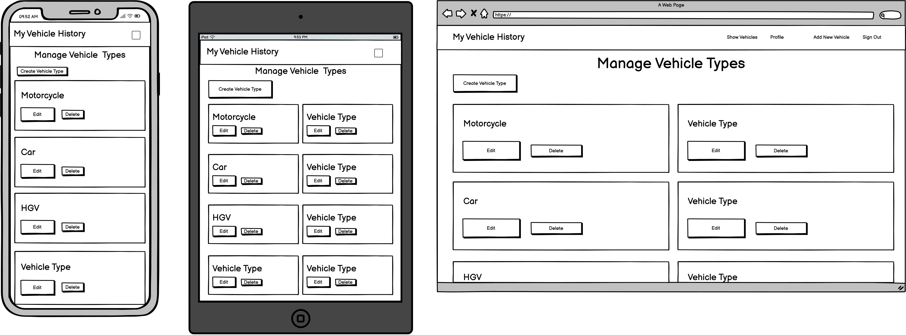

### Add Vehicle Types Page Wireframes

- 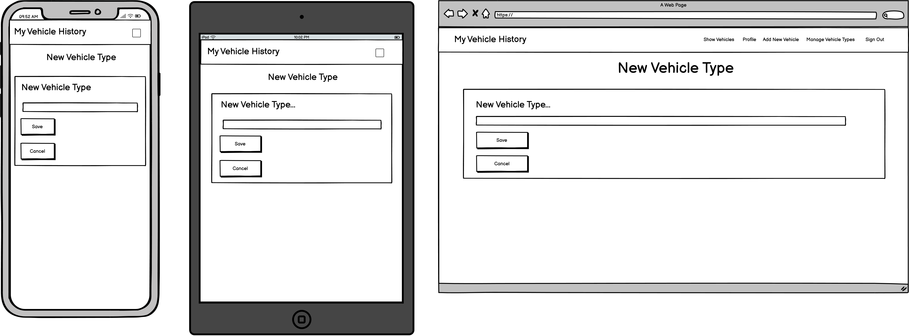

### Edit Vehicle Types Page Wireframes

- 

## Database Design

My project uses a non-relational database with MongoDB, and therefore the database architecture doesn't have actual relationships like a relational database would.

My database is called **my_vehicle_history**.

It contains 3 collections:

- **vehicle_types**
    | Key | Type | Notes |
    | --- | --- | --- |
    | _id | ObjectId() | |
    | vehicle_type | String | |

- **vehicles**
    | Key | Type | Notes |
    | --- | --- | --- |
    | _id | ObjectId() | |
    | vehicle_type | String | selected from *vehicle_types* collection |
    | make | String | |
    | model | String | |
    | capacity | String | |
    | year | String | |
    | colour | String | |
    | current_owner | String | |
    | show_my_vehicle | String | |
    | description | String | |
    | image_url | String | |
    | litres_cc | String | |
    | created_by | String | selected from the *users* collection |

- **users**
    | Key | Type | Notes |
    | --- | --- | --- |
    | _id | ObjectId() | |
    | username | String | |
    | password | String | uses Secure Hash Algorithm (SHA) |

## Features

### Existing Features

**Responsive Design**

- A mobile first, responsive design to help provide site users with a similar experience across a range of web browsers and devices.
	 


**Custom Logo**

- A custom logo design for user's to easily identify the website.


**Favicon**

- A custom favicon, making it easy to identify this site alongside others in open tabs within the users browser.

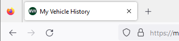

**Registration System**

- A registration system to enable site visitors to create a user account.
This features a username and password input which, when submitted is checked against any existing usernames.
If the username and or password do not pass validation, a message is given to the user that either, the username and/or password is incorrect. This helps provide an extra element of security. In addition, the control of username and password creation, via the form fields. These are set to only accept a regular expression pattern that only allows for A-Z upper and lowercase, with numbers 0-9. With a minimum amount of characters of 5, and maximum of 15.
Upon username and password validation, an account is created for the user. This allows the user access to their own account, and they are taken to their Profile page.
The Registration page also contains a message to the user with link to follow, in case they have already registered.


**Sign-In and Sign-Out Functionality**

- The user can sign-in to their account in order to add, view, edit or delete any vehicles.
Upon the user submitting their username and password. The details are checked against those already held in the database. The password held within the database is hashed using a 256bit encyription algorithm. If the username and or password do not pass validation, a message is given to the user that either, the username and/or password is incorrect.
If validation is passed, the user has access to their account and is taken to the Profile page, in order to view their own vehicles.
The user can sign-out of their account whenever they wish, by using the Sign-Out option, found in the navigation menu. A message is provided to let the user know they have successfully signed out, as they are returned to the Sign-In page.


**Navigation Menu**

- An easy to use navigation system for user's to travel between site areas. Implemented via Bootstrap 5, I have customised the colours used, and provided the functionality for the menu options to highlight with regard to the page the user is currently viewing.

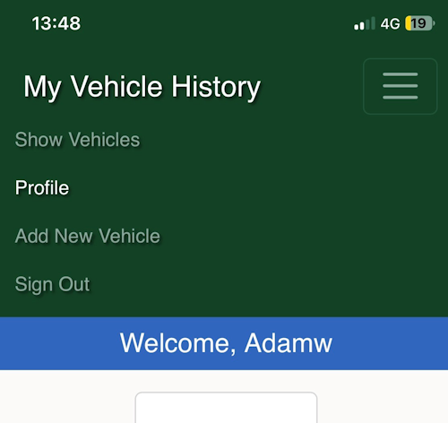

**Full CRUD Functionality**

- By using backend technology, this application features all the functionality of CRUD. Giving user's the ability to create a new vehicle to upload to the database. The ability to view the vehicle, either within their own Profile page and/or the Show Vehicles page. The user can edit any of the vehicles they have uploaded to the site. Lastly, the user can delete any of their vehicles.


**Show Vehicles Page**

- The Show Vehicles features a collection of all vehicles that existing member's of the site would like to show. To anyone visiting the site, and other site member's to appreciate. This option is available via a switch on the add/edit vehicle pages.
As a signed-in user, you can find your own 'Show Vehicles' listed here with others. Any of the user's own vehicles displayed will also contain two buttons. One to edit, the other to delete the current vehicle.


**Profile Page**

- The Profile page is a feature to allow each user their own space to store any vehicles.
Upon signing in, the user's registered username is displayed within a card element at the top of the page.
A message is also displayed which contains a personalised reference to the user via their registered username.
Any vehicles already stored by the user are shown below the message area at the top of the page.
Each of the vehicle's returned to be displayed contain two buttons. One to edit, the other to delete the current vehicle.


**Add Vehicle Page**

- The Add Vehicle page features a customised form to give the registered/signed-in user the ability to add to their own vehicle history.
The form features multiple labels and inputs for various vehicle details. Some of these inputs are required to be filled in for the form to submit successfully. All of these inputs are marked with an asterisk. I have selected the chosen fields as required: Type, Model, Make, Engine Capacity, Add Photo. As I believe these to be the minimum amount of data to be collected in order for the site to function as intended. For storing vehicle details and a photograph.

- Form validation occurs in relation to each input type.
The Vehicle Type is chosen using a select element containing pre-defined values, entered into the database via the site Administrator.
The Make input restricts names to a minimum of 2 characters (e.g. MG), and a maximum of 25. This also features a pattern match using a regular expression, to allow for A-Z upper and lower case, 0-9 and whitespace.

- The Model input restricts names to a minimum of 1 characters (e.g. Model 'T' Ford), and a maximum of 25. This also features a pattern match using a regular expression, to allow for A-Z upper and lower case, 0-9 and whitespace.

- The Engine Capacity is a number input type. Only allowing for numbers between, 0.1 and 9999. And can be incremented by a step of 0.1. This to allow for an engine capacity of 0.5 Litres, as an example.

- This form also features a couple of radio button selectors. To allow the user to choose between Litres or Cylinder Capacity. In order to have a better reference to the Engine Capacity, above. This is pre-defined to the option of Litres.

- The form features an input for the user to record the year of manufacture of the vehicle in question. I have attempted to control the data accepted by using a number input type. Which only accepts numbers between 1885 (to encompass historical vehicles) and 2026. The maximum number shall be increased over time with future updates.

- The form features a colour input of a text type. Which allows a minimum of 3 characters,(e.g. Red), and a maximum of 20 characters. It also features a pattern match using a regular expression, to allow for A-Z upper and lower case, 0-9 and whitespace.

- The form also features a 'Current Owner' switch. Allowing the user to record whether they currently possess the vehicle they are adding.

- The form also features a Show My Vehicle' switch. Allowing the user the option to showcase their vehicle with other site member's on the Show Vehicles page.

- This form features a file input for user's to upload an image of their vehicle.
Through implementing the file storage service, using the API from Cloudinary. The site allows a user to upload a photo be stored in the cloud, and later retrieved via the URL held within the database. This is to combat an issue related to Heroku's emphemeral filesystem, when trying to retrieve uploaded files.

- The form also features a textarea input, to allow users the ability to record any details of their vehicles not featured above. Giving the user the possibliy to log any vehicle modifications, etc. The form allows for a maximum of 200 characters. Data is also handled using the `strip()` function, from within the add_new_vehicle function, in order to remove any leading and/or trailing whitespace.

- In addition there features two buttons at the end of the form.
A blue coloured button for form submission called, "Add Vehicle". To add the information to the database. The other, a red coloured button named, "Cancel". Incase the user changes their mind.


**Edit Vehicle Page**

- The Edit Vehicle page features all of the form inputs as used within the Add New Vehicle page. These come pre-populated with any matching data found within the database.
This feature allows the user the ability to update any information already held about a particular vehicle of theirs.


**Search Box**

- The search for vehicle functionality appears at the top of the Show Vehicles page. It allows users to search the database for vehicles by type, make or model from the vehicles made available using the 'Show My Vehicle' option.

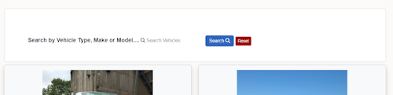

**Administration Access**

- This application allows for Administrative Access. As a registered user with admin credentials, you can access the site to perform any changes to the vehicle types used within the Vehicle Types Selector on both the Add New Vehicle and Edit Vehicle pages.
The admin user is greeted with a message stating that they are signed-in as an administrator.

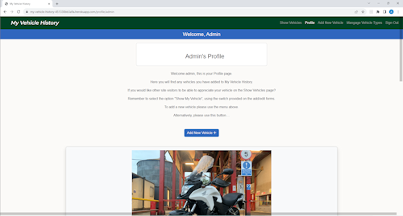

**Manage Vehicle Types**

- This feature is only accessable if you are signed-in as the site Administrator.
It allows for full CRUD functionality with regards to the vehicle types, used within the selector on the Add New Vehicle and Edit Vehicle pages.

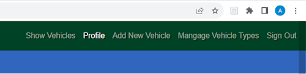

**Deletion Confirmation**

- As a defensive approach to the possiblity that any of the deletion options on the site are selected by mistake. I have added a modal component to give the user or admin user, a further saftey feature to confirm deletion of the vehicle or vehicle type in question.

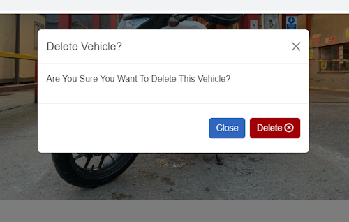

### Future Implementations

**Extra Form Inputs**

- Add inputs to get data for horsepower, and torque rating.
Month and year of purchase?
Duration of ownership?

**Contact Page**

- Implement Flask Mail. So site user's can contact me with any suggestions. Or report any problems they may be experiencing.

**Ratings System**

- A ratings system for visitors/members to be able to rate each others vehicles. 

**Update Registration Requirements**

- Include email address and confirmation of email address.
Possibly implement Re-Capture? Google Authentication, etc.

### Accessibility

I have designed this website with the intention of making it easy for all users to navigate and enjoy.
I have tried to adhere to current best practices during the production of this website.
I have tested the website using Google Lighthouse.
I have also tested the website using WAVE, [Web Accessibility Evaluation](https://my-vehicle-history-451330bb3a9a.herokuapp.com/) to check for any major issues.
Results from this can be found in the TESTING.md.

## Technologies Used

### Languages Used

Python, HTML and CSS.

### Frameworks, Libraries & Programs Used

- [Balsamiq](https://balsamiq.com/wireframes) used to create the sites wireframes.
- [Google Fonts](https://fonts.google.com) used to import the fonts used within the site.
- [Bootstrap](https://getbootstrap.com) used as the front-end CSS framework for modern responsiveness and pre-built components.
- [Python](https://www.python.org) used as the back-end programming language.
- [Flask](https://flask.palletsprojects.com) used as the Python framework for the site.
- [MongoDB](https://www.mongodb.com) used as the non-relational database management with Flask.
- [Heroku](https://www.heroku.com) used for hosting the deployed back-end site.
- [Cloudinary](https://cloudinary.com) used for online static file storage.
- [Fontawesome](https://fontawesome.com/) icons used throughout the site.
- [Git](https://git-scm.com) used for version control. (`git add`, `git commit`, `git push`)
amiresponsive
- [GitHub](https://github.com) used for secure online code storage.
- [Codeanywhere](https://codeanywhere.com/) used as a cloud-based IDE for development.
- Google Dev Tools - Accessed from Google Chrome.

## Deployment & Local Development

### Deployment

The live deployed application can be found on [Heroku](https://my-vehicle-history-451330bb3a9a.herokuapp.com).

### MongoDB Non-Relational Database

This project uses [MongoDB](https://www.mongodb.com) for the Non-Relational Database.

To obtain your own MongoDB Database URI, sign-up on their site, then follow these steps:

- The name of the database on MongoDB should be called **My_Vehicle_History**.
- The collection(s) needed for this database should be **users, vehicle_types and vehicles**.
- Click on the **Cluster** name created for the project.
- Click on the **Connect** button.
- Click **Connect Your Application**.
- Copy the connection string, and replace `password` with your own password (also remove the angle-brackets).

### Heroku Deployment

This project uses [Heroku](https://www.heroku.com), a platform as a service (PaaS) that enables developers to build, run, and operate applications entirely in the cloud.

Deployment steps are as follows, after account setup:

- Select **New** in the top-right corner of your Heroku Dashboard, and select **Create new app** from the dropdown menu.
- Your app name must be unique, and then choose a region closest to you (EU or USA), and finally, select **Create App**.
- From the new app **Settings**, click **Reveal Config Vars**, and set your environment variables.

| Key | Value |
| --- | --- |
| `DATABASE_URL` | user's own value |
| `IP` | 0.0.0.0 |
| `MONGO_DBNAME` | user's own value |
| `MONGO_URI` | user's own value |
| `PORT` | 5000 |
| `SECRET_KEY` | user's own value |

Heroku needs two additional files in order to deploy properly.

- requirements.txt
- Procfile

You can install this project's **requirements** (where applicable) using:

- `pip3 install -r requirements.txt`

If you have your own packages that have been installed, then the requirements file needs updating using:

- `pip3 freeze --local > requirements.txt`

The **Procfile** can be created with the following command:

- `echo web: python app.py > Procfile`
- *replace **app.py** with the name of your primary Flask app name; the one at the root-level*

For Heroku deployment, follow these steps to connect your own GitHub repository to the newly created app:

Either:

- Select **Automatic Deployment** from the Heroku app.

Or:

- In the Terminal/CLI, connect to Heroku using this command: `heroku login -i`
- Set the remote for Heroku: `heroku git:remote -a app_name` (replace *app_name* with your app name)
- After performing the standard Git `add`, `commit`, and `push` to GitHub, you can now type:
  - `git push heroku main`

The project should now be connected and deployed to Heroku!

### Cloudinary

To obtain your own Cloudinary account, sign-up on their site, then follow these steps:

- In the terminal/CLI, `pip install cloudinary`.
- In the app.py file, `import cloudinary`, `cloudinary.uploader` and `cloudinary.api`.
- In the `env.py` file, add **CLOUD_NAME, API_KEY and API_SECRET_KEY**.

Sample from `env.py` file:

```
os.environ.setdefault("CLOUD_NAME", "user's own value")
os.environ.setdefault("API_KEY", "user's own value")
os.environ.setdefault("API_SECRET", "user's own value")
```

Sample from `app.py` file:

```
# cloudinary configuration settings
cloudinary.config(
    cloud_name=os.environ.get("CLOUD_NAME"),
    api_key=os.environ.get("API_KEY"),
    api_secret=os.environ.get("API_SECRET")
)
```
Back in the Heroku app, click **Reveal Config Vars** and set these new environment variables.

| Key | Value |
| --- | --- |
| `CLOUDINARY_API` | user's own value |
| `CLOUD_NAME` | user's own value |
| `API_KEY` | user's own value |
| `API_SECRET` | user's own value |

Remember to update your requirements file:

- `pip3 freeze --local > requirements.txt`

### Local Deployment

This project can be cloned or forked in order to make a local copy on your own system.

#### Cloning

You can clone the repository by following these steps:

1. Go to the [GitHub repository](https://github.com/Ad-White/my-vehicle-history)
2. Locate the Code button above the list of files and click it
3. Select if you prefer to clone using HTTPS, SSH, or GitHub CLI and click the copy button to copy the URL to your clipboard
4. Open Git shell or Terminal
5. Change the current working directory to the one where you want the cloned directory
6. In your IDE Terminal, type the following command to clone my repository:
	- `git clone https://github.com/Ad-White/my-vehicle-history.git`
7. Press Enter to create your local clone.

#### Forking

By forking the GitHub Repository, we make a copy of the original repository on our GitHub account to view and/or make changes without affecting the original owner's repository.
You can fork this repository by using the following steps:

1. Log in to GitHub and locate the [GitHub Repository](https://github.com/Ad-White/my-vehicle-history)
2. At the top of the Repository (not top of page) just above the "Settings" Button on the menu, locate the "Fork" Button.
3. Once clicked, you should now have a copy of the original repository in your own GitHub account!

## Testing

For all testing, please refer to the [TESTING.md](TESTING.md) file.

## Credits

### Content

| Source | Location | Notes |
| --- | --- | --- |
| [Bootstrap](https://getbootstrap.com/docs/5.3/getting-started/introduction/) | entire site | responsive |
| [W3Schools](https://www.w3schools.com/) | entire site | general resource |
| [Stackoverflow](https://stackoverflow.com/) | entire site | general resource |
| [Flask](https://flask.palletsprojects.com) | entire site | general resource |
| [Mozilla For Developers](https://developer.mozilla.org/en-US/docs/Web/) | arai related issue with navbar | general resource |
| [Cloudinary](https://cloudinary.com) | add and edit image used | general resource
| [Markdown Builder by Tim Nelson](https://traveltimn.github.io/markdown-builder) | README and TESTING | tool to help generate the Markdown files |

### Media

All photographs used throughout this site have been added by either myself or user's of the site themselves.
  
### Acknowledgments

- I would like to acknowledge .....
