# Testing

Return back to the [README.md](README.md) file.

## Code Validation

### HTML

I have used the recommended [HTML W3C Validator](https://validator.w3.org) to validate my HTML.
Inital results through testing by URI and by testing by Direct Input are as follows...

Testing By URI:

| Testing URI | W3C URL | Screenshot |
| --- | --- | --- |
| By URI | [W3C](https://validator.w3.org/nu/?doc=https%3A%2F%2Fmy-vehicle-history-451330bb3a9a.herokuapp.com%2F) |  |

Testing by Direct Input:

| Page | Screenshot |
| --- | --- |
| Registration |  |
| Sign-In |  |
| Profile |  |
| Show Vehicles |  |
| Add New Vehicle |  |
| Edit Vehicle (results - page 1) |  |
| Edit Vehicle (results - page 2) |  |
| Manage Vehicle Types |  |
| Add New Vehicle Type |  |
| Edit Vehicle Type |  |

### CSS

I have used the recommended [CSS Jigsaw Validator](https://jigsaw.w3.org/css-validator) to validate my CSS file.
I tested the my css code by copying and testing by Direct Input.

| File | Screenshot | Notes |
| --- | --- | --- |
| style.css |  | Pass - No Errors Found |
|  related css warning |  | 1 Warning: Imported style sheets are not checked in direct input and file upload modes |

### Python and Jinja Syntax

I have used the [PEP8 CI Python Linter](https://pep8ci.herokuapp.com/) application in order to test my Python and Jinja syntax.

| File | CI URL | Screenshot | Notes |
| --- | --- | --- | --- |
| app.py - Inital Test Result | --- |  | 1 case of trailing whitespace. No newline at end of file |
| app.py - Final Test Result | [PEP8 CI Python Linter](https://pep8ci.herokuapp.com/https://raw.githubusercontent.com/Ad-White/my-vehicle-history/main/app.py) |  | All clear, no errors found |

## Browser Compatibility

I've tested my deployed project on multiple browsers to check for compatibility issues.

| Browser | Register | Sign-In | Profile | Show Vehicles | Add New Vehicle | Edit Vehicle | Manage Vehicle Types | Add Vehicle Type | Edit Vehicle Type | Notes |
| --- | --- | --- | --- | --- | --- | --- | --- | --- | --- | --- |
| Chrome |  |  |  |  |  |  |  |  |  | Works as expected |
| Safari |  |  |  |  |  |  |  |   |  | Minor CSS difference with logo font not being italic |
| Firefox |  |  |  |  |  |  |  |  |  | Works as expected |

## Responsiveness

I've tested my deployed project on multiple devices to check for responsiveness issues.

| Browser | Register | Sign-In | Profile | Show Vehicles | Add New Vehicle | Edit Vehicle | Manage Vehicle Types | Add Vehicle Type | Edit Vehicle Type | Notes |
| --- | --- | --- | --- | --- | --- | --- | --- | --- | --- | --- |
| Mobile |   |  |  |  |  |  |  |   |  | Works as expected |
| Tablet |   |  |  |  |  |  |  |   |  | Works as expected |
| Desktop |  |  |  |  |  |  |  |  |  | Works as expected |

## Lighthouse Audit

I've tested my deployed project using the Lighthouse Audit tool to check for any major issues.
These are the results after inital testing. Testing conducted for both Navigation and Snapshots on mobile and desktop.

| Test Used | Page | Size | Screenshot | Notes |
| --- | --- | --- | --- | --- |
| Navigation | --- | Mobile | 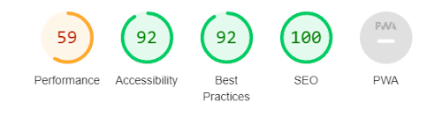 | Performance related issues regarding handling of images. ARIA IDs are not unique (modal related). Issues were logged in the Issues panel in Chrome Devtools, related to cloudinary images used. |
| Navigation | --- | Desktop | 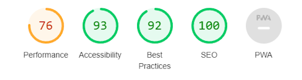 | Performance related issues regarding handling of images. ARIA IDs are not unique (modal related). Issues were logged in the Issues panel in Chrome Devtools, related to cloudinary images used. |

| Test Used | Page | Size | Screenshot | Notes |
| --- | --- | --- | --- | --- |
| Snapshot | Registration | Mobile|  | --- |
| Snapshot | Sign-In | Mobile |   | --- |
| Snapshot | Profile | Mobile |  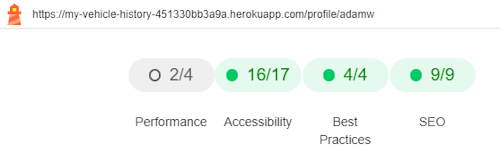 | --- |
| Snapshot | Show Vehicles | Mobile |  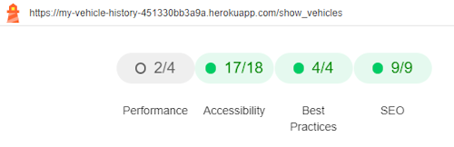 | --- |
| Snapshot | Add New Vehicle | Mobile |  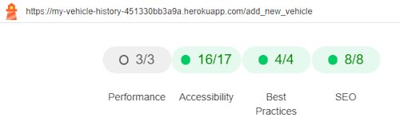 | --- |
| Snapshot | Edit Vehicle | Mobile |  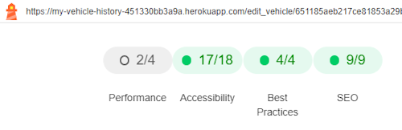 | --- |
| Snapshot | Manage Vehicle Types | Mobile |   | --- |
| Snapshot | Add Vehicle Type | Mobile |   | --- |
| Snapshot | Edit Vehicle Type | Mobile |  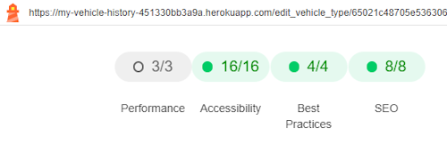 | --- |
| Snapshot | Registration | Desktop | 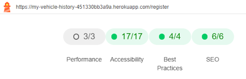 | --- |
| Snapshot | Sign-In | Desktop |  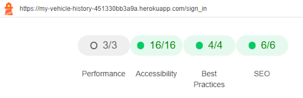 | --- |
| Snapshot | Profile | Desktop |  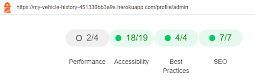 | --- |
| Snapshot | Show Vehicles | Desktop |  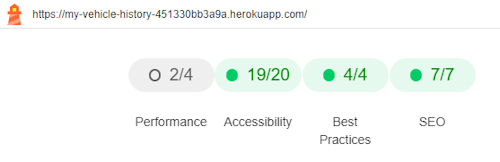 | --- |
| Snapshot | Add New Vehicle | Desktop |  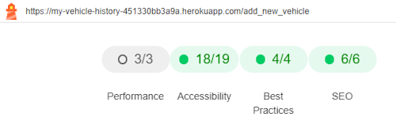 | --- |
| Snapshot | Edit Vehicle | Desktop |  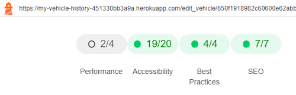 | --- |
| Snapshot | Manage Vehicle Types | Desktop |   | --- |
| Snapshot | Add Vehicle Type | Desktop |   | --- |
| Snapshot | Edit Vehicle Type | Desktop |   | --- |

### WAVE Reports

I have tested the website using WAVE, [Web Accessibility Evaluation](https://my-vehicle-history-451330bb3a9a.herokuapp.com/) to check for any major issues.
These are the results after inital testing.

| Page | Screenshot | Notes |
| --- | --- | --- |
| Registration | 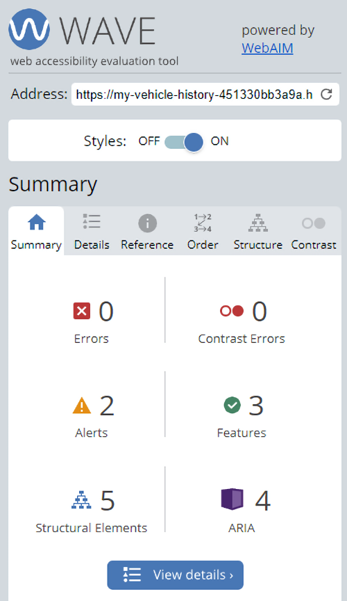 | No Errors. 2 alerts related to `<h1>` tag not present and Arai-Current Page Selection |
| Sign_In |  | No errors. 3 alerts related to `<h1>` tag not present and Arai-Current Page Selection. Register Account link - Adjacent links go to the same URL. |
| Profile | --- | Would not allow testing |
| Show Vehicles | 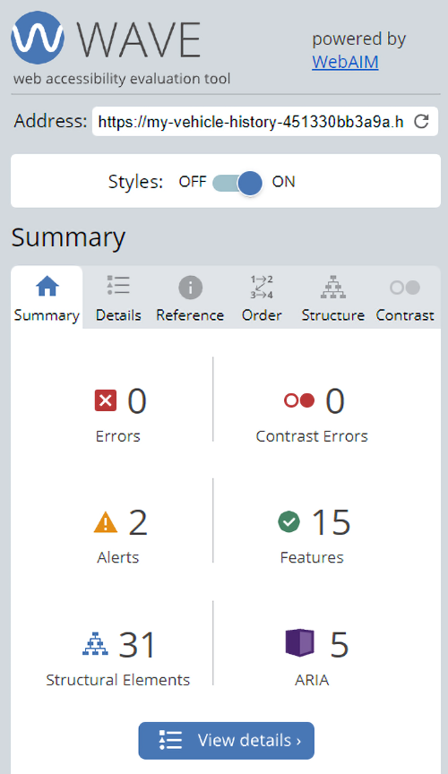 | No Errors. 2 alerts related to `<h1>` tag not present and Arai-Current Page Selection |
| Add Vehicle | 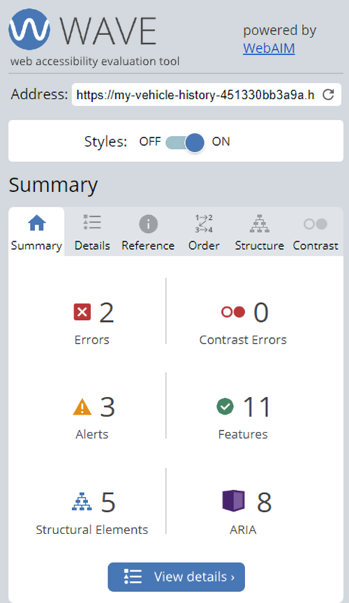 | No errors. 2 alerts related to `<h1>` tag not present and Arai-Current Page Selection |
| Edit Vehicle | 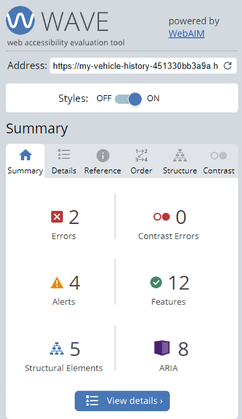 | 2 errors, related to radio selectors having same ID. 4 alerts, `<h1>` tag not present and Arai-Current Page Selection. The other 2 related to the radio selectors |
| Manage Vehicle Types | 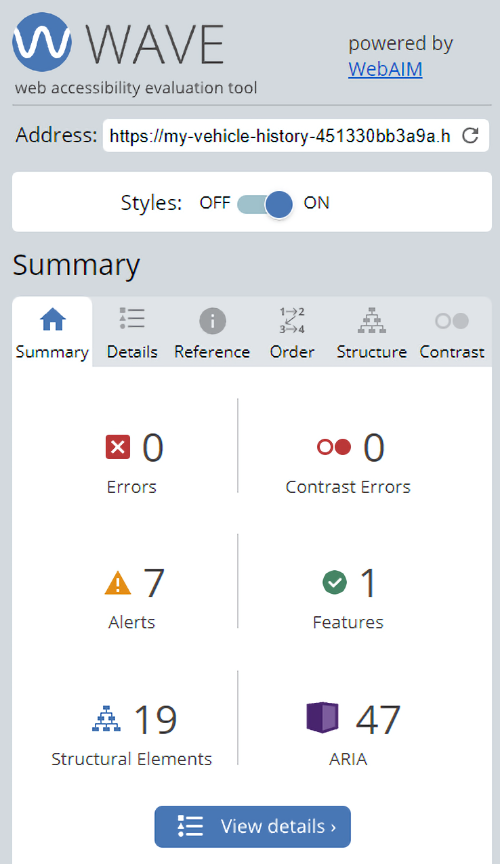 | No errors. 7 alerts related to heading tag hierachy |
| Add Vehicle Type |  | 2 errors, related to radio selectors having same ID. 3 alerts, `<h1>` tag not present and Arai-Current Page Selection. |
| Edit Vehicle Type |  | No errors. 2 alerts related to `<h1>` tag not present and Arai-Current Page Selection |

I have since attempted to reduce and eliminate any remaining errors and alerts. See the Bugs and Issues section for more information.

## User Story Testing

| User Story | Screenshot |
| --- | --- |
| As a new site user, I would like to view a selection of vehicles consisting of those presented by the existing member's of the website. | 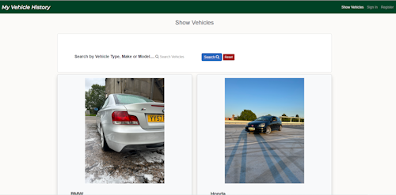 |
| As a new site user,  I would like to be able to preform a search through the vehicles on the Show Vehicles page by either, make, model or vehicle type. |  |
| As a new site user, I would like to be able to have a way to easily navigate my way around the site. |   |
| As a new site user,  I would like to register as a new site member, and have access to my own profile area. With the ability to be able to upload details of my vehicle, including an image of my vehicle. | 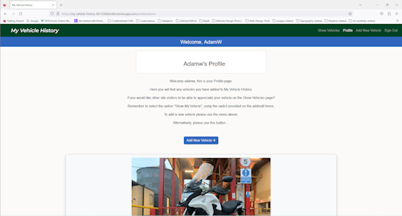 |
| As a new site user, I would like to be able to edit the details and image of my vehicle, and to save those changes. |  |
| As a new site user, I would like the ability to add my own vehicle to the Show Vehicles page, alongside other site member's vehicles. | 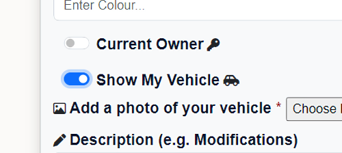 |
| As a new site user, I would like the ability to not add my own vehicle to the Show Vehicles page, alongside other site member's vehicles. I would prefer if it were kept private to myself. | 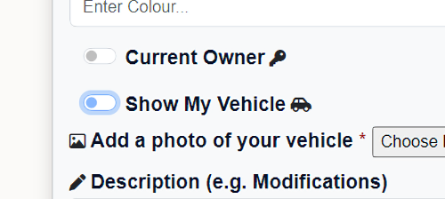 |
| As a new site user, I would like to be able to delete any of my vehicles from my collection if I choose.
 |  |
| As a new site user, I would like the ability to sign out of the website. | 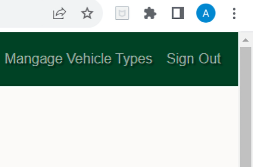 |
