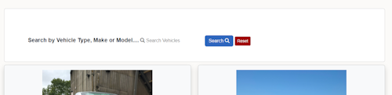
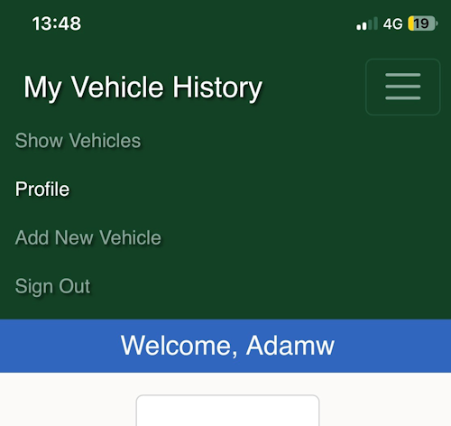
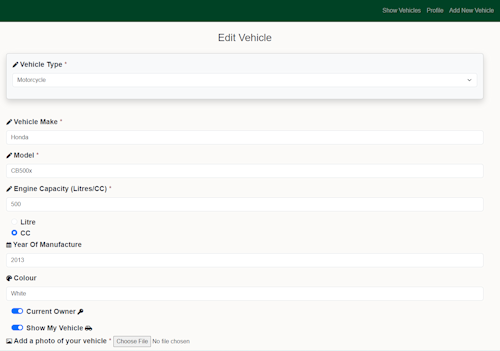
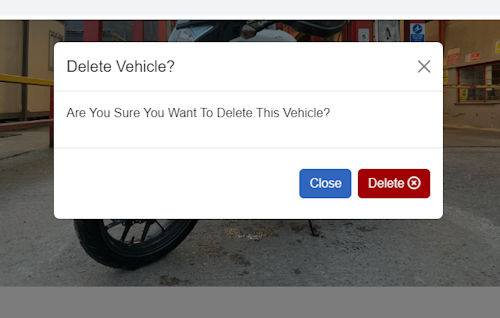
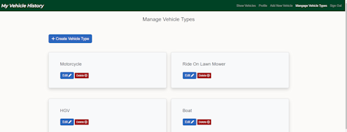
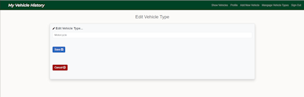

# Testing

Return back to the [README.md](README.md) file.

## Code Validation

### HTML

I have used the recommended [HTML W3C Validator](https://validator.w3.org) to validate my HTML.
Inital results through testing by URI and by testing by Direct Input are as follows...

Testing By URI:

| Testing URI | W3C URL | Screenshot |
| --- | --- | --- |
| By URI | [W3C](https://validator.w3.org/nu/?doc=https%3A%2F%2Fmy-vehicle-history-451330bb3a9a.herokuapp.com%2F) |  |

Testing by Direct Input:

| Page | Screenshot |
| --- | --- |
| Registration |  |
| Sign-In |  |
| Profile |  |
| Show Vehicles |  |
| Add New Vehicle |  |
| Edit Vehicle (results - page 1) |  |
| Edit Vehicle (results - page 2) |  |
| Manage Vehicle Types |  |
| Add New Vehicle Type |  |
| Edit Vehicle Type |  |

### CSS

I have used the recommended [CSS Jigsaw Validator](https://jigsaw.w3.org/css-validator) to validate my CSS file.
I tested my css code by copying and testing by Direct Input.

| File | Screenshot | Notes |
| --- | --- | --- |
| style.css |  | Pass - No Errors Found |
|  related css warning |  | 1 Warning: Imported style sheets are not checked in direct input and file upload modes |

### Python and Jinja Syntax

I have used the [PEP8 CI Python Linter](https://pep8ci.herokuapp.com/) application in order to test my Python and Jinja syntax.

| File | CI URL | Screenshot | Notes |
| --- | --- | --- | --- |
| app.py - Inital Test Result | --- |  | 1 case of trailing whitespace. No newline at end of file |
| app.py - Final Test Result | [PEP8 CI Python Linter](https://pep8ci.herokuapp.com/https://raw.githubusercontent.com/Ad-White/my-vehicle-history/main/app.py) |  | All clear, no errors found |

## Browser Compatibility

I've tested my deployed project on multiple browsers to check for compatibility issues.

| Browser | Register | Sign-In | Profile | Show Vehicles | Add New Vehicle | Edit Vehicle | Manage Vehicle Types | Add Vehicle Type | Edit Vehicle Type | Notes |
| --- | --- | --- | --- | --- | --- | --- | --- | --- | --- | --- |
| Chrome |  |  |  |  |  |  |  |  |  | Works as expected |
| Safari |  |  |  |  |  |  |  |   |  | Minor CSS difference with logo font not being italic |
| Firefox |  |  |  |  |  |  |  |  |  | Works as expected |

## Responsiveness

I've tested my deployed project on multiple devices to check for responsiveness issues.

| Browser | Register | Sign-In | Profile | Show Vehicles | Add New Vehicle | Edit Vehicle | Manage Vehicle Types | Add Vehicle Type | Edit Vehicle Type | Notes |
| --- | --- | --- | --- | --- | --- | --- | --- | --- | --- | --- |
| Mobile |   |  |  |  |  |  |  |   |  | Works as expected |
| Tablet |   |  |  |  |  |  |  |   |  | Works as expected |
| Desktop |  |  |  |  |  |  |  |  |  | Works as expected |

## Lighthouse Audit

I've tested my deployed project using the Lighthouse Audit tool to check for any major issues.
These are the results after inital testing. Testing conducted for both Navigation and Snapshots on mobile and desktop.

| Test Used | Page | Size | Screenshot | Notes |
| --- | --- | --- | --- | --- |
| Navigation | --- | Mobile |  | Performance related issues regarding handling of images. ARIA IDs are not unique (modal related). Issues were logged in the Issues panel in Chrome Devtools, related to cloudinary images used. |
| Navigation | --- | Desktop |  | Performance related issues regarding handling of images. ARIA IDs are not unique (modal related). Issues were logged in the Issues panel in Chrome Devtools, related to cloudinary images used. |

| Test Used | Page | Size | Screenshot | Notes |
| --- | --- | --- | --- | --- |
| Snapshot | Registration | Mobile|  | --- |
| Snapshot | Sign-In | Mobile |   | --- |
| Snapshot | Profile | Mobile |   | --- |
| Snapshot | Show Vehicles | Mobile |   | --- |
| Snapshot | Add New Vehicle | Mobile |   | --- |
| Snapshot | Edit Vehicle | Mobile |   | --- |
| Snapshot | Manage Vehicle Types | Mobile |   | --- |
| Snapshot | Add Vehicle Type | Mobile |   | --- |
| Snapshot | Edit Vehicle Type | Mobile |   | --- |
| Snapshot | Registration | Desktop |  | --- |
| Snapshot | Sign-In | Desktop |   | --- |
| Snapshot | Profile | Desktop |   | --- |
| Snapshot | Show Vehicles | Desktop |   | --- |
| Snapshot | Add New Vehicle | Desktop |   | --- |
| Snapshot | Edit Vehicle | Desktop |   | --- |
| Snapshot | Manage Vehicle Types | Desktop |   | --- |
| Snapshot | Add Vehicle Type | Desktop |   | --- |
| Snapshot | Edit Vehicle Type | Desktop |   | --- |

### WAVE Reports

I have tested the website using WAVE, [Web Accessibility Evaluation](https://my-vehicle-history-451330bb3a9a.herokuapp.com/) to check for any major issues.
These are the results after inital testing.

| Page | Screenshot | Notes |
| --- | --- | --- |
| Registration |  | No Errors. 2 alerts related to `<h1>` tag not present and Arai-Current Page Selection |
| Sign_In |  | No errors. 3 alerts related to `<h1>` tag not present and Arai-Current Page Selection. Register Account link - Adjacent links go to the same URL. |
| Profile | --- | Would not allow testing |
| Show Vehicles |  | No Errors. 2 alerts related to `<h1>` tag not present and Arai-Current Page Selection |
| Add Vehicle |  | No errors. 2 alerts related to `<h1>` tag not present and Arai-Current Page Selection |
| Edit Vehicle |  | 2 errors, related to radio selectors having same ID. 4 alerts, `<h1>` tag not present and Arai-Current Page Selection. The other 2 related to the radio selectors |
| Manage Vehicle Types |  | No errors. 7 alerts related to heading tag hierachy |
| Add Vehicle Type |  | 2 errors, related to radio selectors having same ID. 3 alerts, `<h1>` tag not present and Arai-Current Page Selection. |
| Edit Vehicle Type |  | No errors. 2 alerts related to `<h1>` tag not present and Arai-Current Page Selection |

I have since attempted to reduce and eliminate any remaining errors and alerts. See the Bugs and Issues section for more information.

## User Story Testing

| User Story | Screenshot |
| --- | --- |
| As a new site user, I would like to view a selection of vehicles consisting of those presented by the existing member's of the website. |  |
| As a new site user,  I would like to be able to perform a search through the vehicles on the Show Vehicles page by either, make, model or vehicle type. |  |
| As a new site user, I would like to be able to have a way to easily navigate my way around the site. |   |
| As a new site user,  I would like to register as a new site member, and have access to my own profile area. With the ability to be able to upload details of my vehicle, including an image of my vehicle. |  |
| As a new site user, I would like to be able to edit the details and image of my vehicle, and to save those changes. |  |
| As a new site user, I would like the ability to add my own vehicle to the Show Vehicles page, alongside other site member's vehicles. |  |
| As a new site user, I would like the ability to not add my own vehicle to the Show Vehicles page, alongside other site member's vehicles. I would prefer if it were kept private to myself. |  |
| As a new site user, I would like to be able to delete any of my vehicles from my collection if I choose. |  |
| As a new site user, I would like the ability to sign out of the website. |  |
| As a returning site user, I would like to able to sign back in to the site so that I can see my own profile. |  |
| As a returning site user,  I would like all of the abilities of a new user, so that I can create, edit and delete vehicles from my vehicle history. |  |
| As a site administrator, I should be able to sign-in to the website and have more privileges than a general user. |  |
| As a site administrator,  I should be able to edit the names used for the vehicle types selection options. |  |
| As a site administrator, I should be able to create new vehicle types to be used within the vehicle types selection options. |  |
| As a site administrator, I should be able to delete any vehicle type. |  |

## Defensive Programming

Defensive programming was manually tested with the below user acceptance testing:

| Page | User Action | Expected Result | Pass/Fail | Comments |
| --- | --- | --- | --- | --- |
| Registration | | | | |
| | Click on Registration button | Redirection to Registration page | Pass | |
| | Enter valid username | Field will only accept the requested format | Pass | |
| | Enter already taken username | Flash message to user letting them know the username is already taken | Pass | |
| | Press the Register button with nothing entered into the fields | User is prompted to fill out fields | Pass | |
| Sign In | | | | |
| | Click on Sign In button | Redirection to Sign In page | Pass | |
| | Enter valid username | Field will only accept the requested format | Pass | |
| | Enter already taken username | Flash message to user letting them username or password is incorrect | Pass | |
| | Enter valid password (twice) | Field will only accept password format | Pass | |
| | Press the Sign In button with nothing entered into the fields | User is prompted to fill out fields | Pass | |
| Sign Out | | | | |
| | Click Sign Out button | Redirects user to the Sign In page | Pass |  |
| Show Vehicles Page | | | | |
| | Click on Logo | Redirection to Home page | Pass | |
| | Click on Show Vehicles link in navbar | Redirection to Show Vehicles page | Pass | |
| | Click on the Edit button of an existing vehicle for current user | User will be redirected to the Edit Vehicle page | Pass | |
| | Click on the Delete button of an existing vehicle for current user | User will be asked to confirm deletion or can cancel | Pass | |
| Profile | | | | |
| | Click on Profile button | User will be redirected to the Profile page | Pass | |
| | Click on the Add New Vehicle button | User will be redirected to the Add New Vehicle page | Pass | |
| | Click on the Edit button of an existing vehicle | User will be redirected to the Edit Vehicle page | Pass | |
| | Click on the Delete button of an existing vehicle for current user | User will be asked to confirm deletion or can cancel | Pass | |
| | Brute forcing the URL to get to another user's profile | Redirects user back to own profile | Pass |  |
| Add New Vehicle | | | | |
| | Enter valid information in all fields and press Add Vehicle button | New Vehicle is saved to database. Flash message to confirm saved vehicle. Redirect to Show Vehicles page  | Pass | |
| | Enter invalid information in any field and press Add Vehicle button | Fields will only accept the requested format | Pass | |
| | Enter valid information in all fields, but not the required fields and press Add Vehicle button | User is prompted by each individual field for accepted format | Pass | |
| Edit Vehicle | | | | |
| | Enter valid information in all fields and press Save button | Vehicle's new information is saved to database. Flash message to confirm saved vehicle. Redirect to Show Vehicles page  | Pass | |
| | Enter invalid information in any field and press Save button | Fields will only accept the requested format | Pass | |
| | Enter valid information in all fields, but not the required fields and press Save button | User is prompted by each individual field for accepted format | Pass | |
| Manage Vehicle Types | | | | |
| | Press the Create Vehicle Type button | Redirects admin to the Add New Vehicle Type page | Pass | |
| | Press the Edit Vehicle Type button | Redirects admin to the Edit Vehicle Type page | Pass | |
| | Press the Delete button of Vehicle Type | Prompts admin to confirm deletion, or cancel | Pass | |
| | Press the Delete button of Vehicle Type and confirm deletion | Deletion occurs and admin is shown flash message of deletion confirmed and redirected to the Manage Vehicles page | Pass | |
| Add New Vehicle Type | | | | |
| | Enter valid information in the form field and press the Save button | New Vehicle Type is saved to database. Flash message to confirm saved vehicle type. Redirect to Manage Vehicle Types page  | Pass | |
| | Enter invalid information into the field and press the Save button | Fields will only accept the requested format | Pass | |
| | Enter nothing into the field and press the Save button | User is prompted for accepted format | Pass | |
| | Press the Cancel button | User is redirected back to the Manage Vehicle Types page | Pass | |
| Edit Vehicle Type | | | | |
| | Enter valid information in the form field and press the Save button | Edited Vehicle Type is saved to database. Flash message to confirm saved vehicle type. Redirect to Manage Vehicle Types page  | Pass | |
| | Enter invalid information into the field and press the Save button | Fields will only accept the requested format | Pass | |
| | Enter nothing into the field and press the Save button | User is prompted for accepted format | Pass | |
| | Press the Cancel button | User is redirected back to the Manage Vehicle Types page | Pass | |

## Bugs

Throughout developing this application, I have used Google Dev Tools to help pinpoint any errors. I have tested the deployed site as well, for functionality during development.

- Bug 1:

Most of my errors have been as a result of my own doing, e.g. Typo's, misplaced Tags, etc.
The results from testing the HTML is a good example of where I discovered these. On a couple of occasions where I had added code like a new `
`, I had missed that the IDE had closed the tag for me without me noticing. So a few of the errors and warning were erradicated by my going back over my code and finding and correcting these.

- Bug 2:

During testing using the Dev Tool and testing for responsiveness. I noticed I was getting some overflow on the page. I took action to fix this, by researching that I could take control of the viewport and stop any scaling, which at the time seemed to work as a cure. However, this would cause further issues relating to user's of assisted technology.  Also, during later testing it would re-appear. So, I assumed my cure hadn't actually worked. I therefore reverted back to my original code.
Whilst testing on real devices I have not seen this come back to date. My thoughts now are perhaps it was something to do with the Dev Tool itself?

- Bug 3:

Having implemented the Bootstrap Navigation Menu fairly early on. I had failed to realise until a later time, the menu failed to keep track with the "active" page I was on. I have taken steps to fix this programmatically, by adding a variable to each page, ``. And back in the base.html file adding this to each nav link - `<a class="nav-link {{'active' if active_page=='show_vehicles' else '' }}"`. Changing the `active_page` name accordingly.

- Bug 4:

Bug 4 relates to Bug 3. Whilst conducting tests of each page using the WAVE accessibility tool. It was brought to my attention that the problem I had with Bug 3, also effected the result associated with regards to assisted technology. The link didn't move as different pages were viewed. I tried many attempts to fix this. The most successful being through taking a similar approach to Bug 3. This did seem to work, when inspecting the page source. As the `aria-current` page did change and track itself correctly. However, when re-running WAVE tests it still showed as an issue and threw errors in HTML testing as well. Not happy!
I conducted more research and after some time it occured to me to try what I have now implemented. As in replace the `else '' `, with `else 'false' `. This has fixed the HTML errors I was recieving. Yet I am still getting a warning with the WAVE test results.

- Bug 5:

This bug was something I had noticed on my mobile device. With an open tab, alongside all my other tabs. If I had left the site whilst signed in, and later return. I was recieving the error shown below. I expected it to have something to do with losing the cookie for the signed in user?
I have taken the course of action to apply a `try` `except` clause around the sign_in function with the hope that the user will be re-directed to the Sign_In page.

- Bug 6:

This relates to the errors being reported through HTML validation by direct input with regards to the modals used within the site.
Duplication of modal ID's. And my attempts to fix it. I have tried to take a programmatic approach to this, as the results from the database are within a loop. In the process of this I have successfully managed to break my delete functionality by accident, on a number of occasions.
The delete functionality now works, although when testing through direct input in the HTML Validator, it still has this as an issue. Even though validating by URI shows no errors.

- Bug 7:

Not so much a bug, more an issue with performance when testing through Lighthouse. Issues are reported in the console, which is negatively affecting the score, but they appear to all be linked to Cloudinary and the images being returned.

## Fixed Bugs

- Bug 1:

I have been through all the reported issues from the HTML validation, such as trailing slash on void elements. Section lacking heading, bad attribute for `src` on element `img`. Unclosed end tags, and stray end tags. These are no longer being reported.

- Bug 2:

Overflow issue to date has not appeared whilst testing using mobile or desktop.

- Bug 3:

Issue with Navigation Menu has not failed to show the correct page link since I added the code described above.

## Unfixed Bugs

- Bug 4:

For the time being bug 4 remains. I am currently in the process of researching a solution.

- Bug 5:

To date this keeps occuring, despite my attempts. I will research further. Until then, I am hopeful that the 500 response page will take care of it, if it occurs after 'debug' has been switched off.

- Bug 6:

The duplicate ID's are still reported. I will not give up on this!! Further research is required on my part.
As an alternative to using the modals in the way I am. The solution could be to hand the modal over to a JavaScript file to be actioned on pressing the 'delete' button.

- Bug 7:

Performance related issues regarding the returned images from Cloudinary. This is my first go at using the Cloudinary API, therefore I will endeavour to continue developing my knowledge of this API in order to gain a solution.

There are no remaining bugs that I am aware of.
