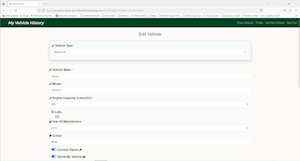

# Testing

Return back to the [README.md](README.md) file.

## Code Validation

### HTML

I have used the recommended [HTML W3C Validator](https://validator.w3.org) to validate my HTML.
Inital results through testing by URI and by testing by Direct Input are as follows...

Testing By URI:

| Testing URI | W3C URL | Screenshot |
| --- | --- | --- |
| By URI | [W3C](https://validator.w3.org/nu/?doc=https%3A%2F%2Fmy-vehicle-history-451330bb3a9a.herokuapp.com%2F) |  |

Testing by Direct Input:

| Page | Screenshot |
| --- | --- |
| Registration |  |
| Sign-In |  |
| Profile |  |
| Show Vehicles |  |
| Add New Vehicle |  |
| Edit Vehicle (results - page 1) |  |
| Edit Vehicle (results - page 2) |  |
| Manage Vehicle Types |  |
| Add New Vehicle Type |  |
| Edit Vehicle Type |  |

### CSS

I have used the recommended [CSS Jigsaw Validator](https://jigsaw.w3.org/css-validator) to validate my CSS file.
I tested the my css code by copying and testing by Direct Input.

| File | Screenshot | Notes |
| --- | --- | --- |
| style.css |  | Pass - No Errors Found |
|  related css warning |  | 1 Warning: Imported style sheets are not checked in direct input and file upload modes |

### Python and Jinja Syntax

I have used the [PEP8 CI Python Linter](https://pep8ci.herokuapp.com/) application in order to test my Python and Jinja syntax.

| File | CI URL | Screenshot | Notes |
| --- | --- | --- | --- |
| app.py - Inital Test Result | --- |  | 1 case of trailing whitespace. No newline at end of file |
| app.py - Final Test Result | [PEP8 CI Python Linter](https://pep8ci.herokuapp.com/https://raw.githubusercontent.com/Ad-White/my-vehicle-history/main/app.py) |  | All clear, no errors found |

## Browser Compatibility

I've tested my deployed project on multiple browsers to check for compatibility issues.

| Browser | Register | Sign-In | Profile | Show Vehicles | Add New Vehicle | Edit Vehicle | Manage Vehicle Types | Add Vehicle Type | Edit Vehicle Type | Notes |
| --- | --- | --- | --- | --- | --- | --- | --- | --- | --- | --- |
| Chrome |  |  |  |  |  |  |  |  |  | Works as expected |
| Safari |  |  |  |  |  |  |  |   |  | Minor CSS difference with logo font not being italic |
| Firefox |  |  |  |  |  |  |  |  |  | Works as expected |

## Responsiveness

I've tested my deployed project on multiple devices to check for responsiveness issues.

| Browser | Register | Sign-In | Profile | Show Vehicles | Add New Vehicle | Edit Vehicle | Manage Vehicle Types | Add Vehicle Type | Edit Vehicle Type | Notes |
| --- | --- | --- | --- | --- | --- | --- | --- | --- | --- | --- |
| Mobile |   |  |  |  |  |  |  |   |  | Works as expected |
| Tablet |   |  |  |  |  |  |  |   |  | Works as expected |
| Desktop |  |  |  |  |  |  |  |  |  | Works as expected |
